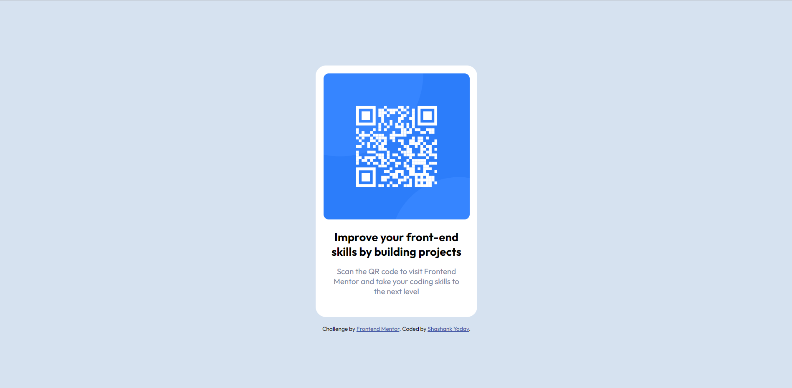

# Frontend Mentor - QR code component solution

This is a solution to the [QR code component challenge on Frontend Mentor](https://www.frontendmentor.io/challenges/qr-code-component-iux_sIO_H).

## Overview

A perfect first challenge if you're new to HTML and CSS.

### Screenshot

### Links

- Solution URL: [Solution URL](https://github.com/yshashanky/qr-code-component-main)
- Live Site URL: [Live site URL](https://qr-code-component-yshashanky.netlify.app)

### Built with

- Semantic HTML5 markup
- CSS
- Flexbox
- [Fonts](https://fonts.google.com/specimen/Outfit)

## Author

- Frontend Mentor - [@yshashanky](https://www.frontendmentor.io/profile/yshashanky)
- Github - [@yshashanky](https://github.com/yshashanky)
